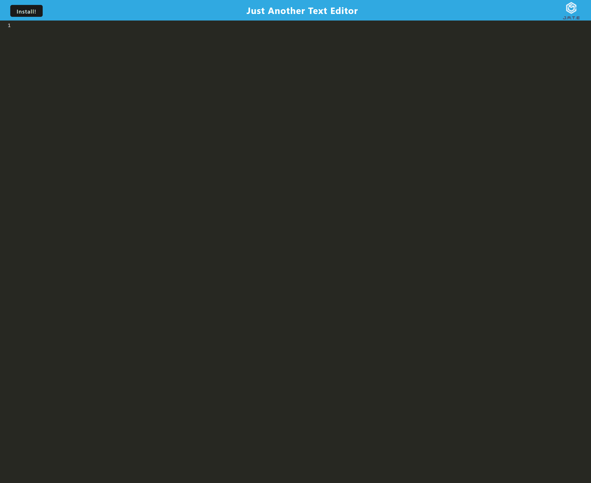

# Text Editor 

## Description

I created an application that functions as a text editor.

## Installation

N/A

## Usage 

This tool was created to practice the following skills:
- Using Markdown to write a README
- JavaScript
- HTML
- Node.js
- Express

#### The work done can be found on the GitHub repository [zahirovic/Text-Editor](https://github.com/zahirovic/Text-Editor).

- The deployed application can be found on [Heroku](https://text-editor-mz.herokuapp.com/) and should look along the lines of this depending on screen size:

## Credits
- [StackOverFlow on pre-receive hook decline from Heroku](https://stackoverflow.com/questions/8216586/git-heroku-pre-receive-hook-declined)
- [Heroku Buildpack](https://devcenter.heroku.com/articles/buildpacks)
- [Heroku Github Integration](https://devcenter.heroku.com/articles/github-integration)

## Features
- JavaScript
- HTML
- Node.js
- Express
- Heroku 
